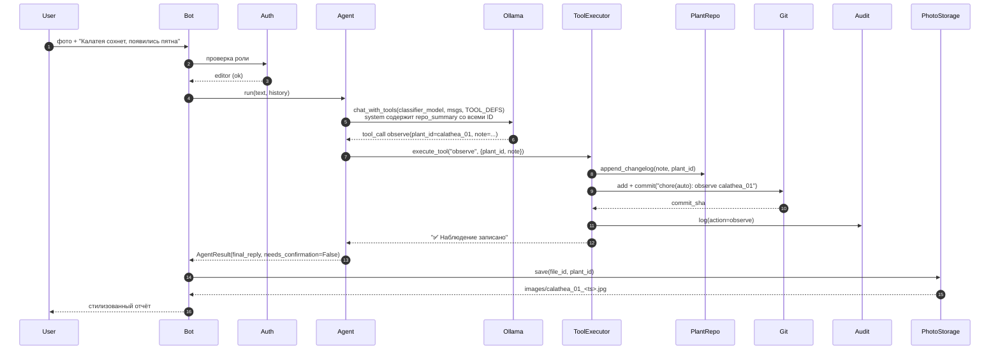
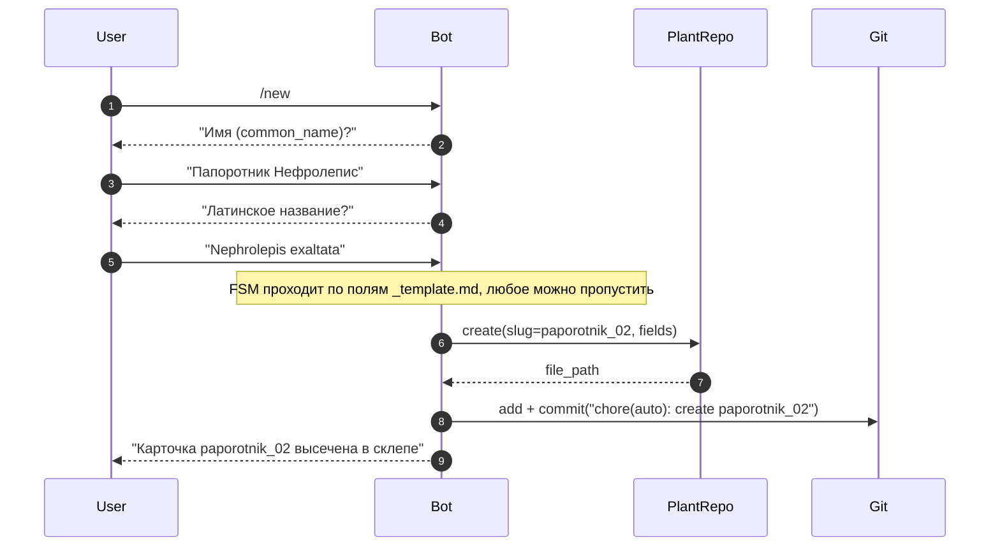
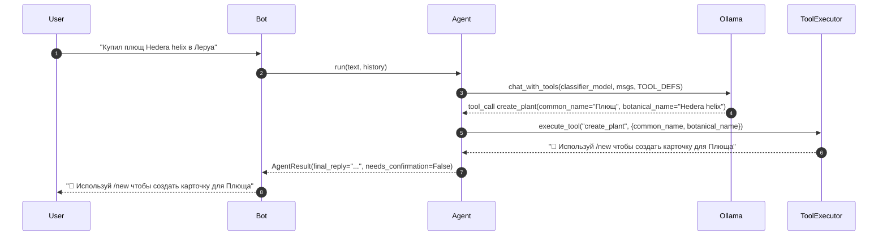
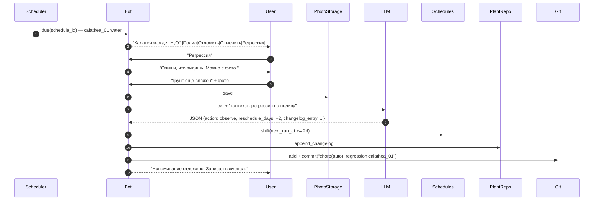

# 03 — Сценарии работы бота

## 3.1. Команды

| Команда | Доступ | Описание |
|---|---|---|
| `/start`, `/help`, `/whoami` | все авторизованные | приветствие, справка, текущая роль |
| `/plants` | editor+ | inline-список растений → выбор контекста |
| `/water`, `/fertilize`, `/repot` | editor+ | прямое действие над текущим растением |
| `/new` | editor+ | создание новой карточки (FSM или быстрый ввод) |
| `/schedule <plant> <kind> <Nd>` | editor+ | создать/обновить расписание |
| `/schedules` | editor+ | список активных расписаний |
| `/snooze <schedule_id> <Nd>` | editor+ | отложить напоминание |
| `/push` | publisher, admin | `git push origin <branch>` |
| `/add_user`, `/set_role`, `/list_users` | admin | управление пользователями |

Свободный текст и фото вне команд направляются в `IntentRouter` → LLM.

## 3.2. Сценарий: наблюдение + фото

> Фото обрабатывается отдельным handler'ом поверх результата агента.  
> Если `confirm_commits=true` — агент вернёт `needs_confirmation=True`; Bot покажет превью с кнопкой «Подтвердить» перед коммитом.

## 3.3. Сценарий: создание карточки

**Вариант 1 — Прямая команда `/new` (FSM)**

**Вариант 2 — Свободный текст через агент**

> `create_plant` — read-only инструмент: реальная запись карточки происходит только через FSM `/new`.

## 3.4. Сценарий: напоминание и регрессия

## 3.5. Неавторизованный доступ
- Сообщение игнорируется (silent) либо ответ-заглушка «Доступ запрещён».
- Админу уходит уведомление: `tg_id`, `username`, текст первого сообщения.
- В `audit_log` пишется `action=access_denied`.

## 3.6. Обработка ошибок
- **LLM не вернула валидный JSON** → один retry с напоминанием формата; иначе ответ-заглушка и предложение использовать прямые команды.
- **Растение не найдено** → бот предлагает: создать новое (`/new`) или выбрать из списка.
- **Git: грязное состояние / конфликт** → коммит блокируется, пользователю стилизованное сообщение, в `audit_log` фиксируется ошибка.
- **Ollama недоступен** → стилизованный «склеп закрыт», прямые команды продолжают работать.
