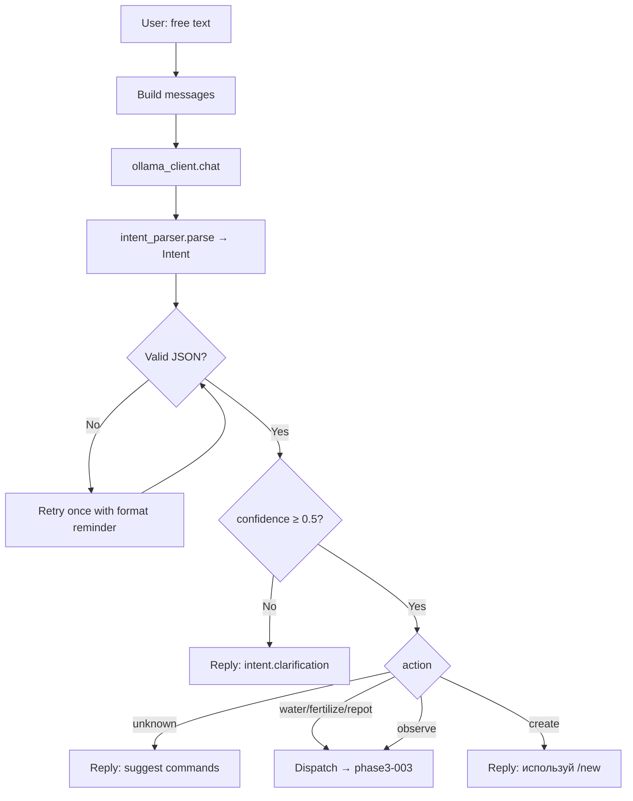

# Phase 3B: LLM Router Handler

**Фаза**: 3
**Статус**: backlog
**Приоритет**: high
**Зависимости**: phase3-001 (ollama client)
**Блокирует**: phase3-003

## Описание

Реализовать handler, который ловит весь свободный текст (не-команды) и прогоняет через LLM-пайплайн:
сборка messages → вызов Ollama → парсинг Intent → ветвление по confidence/action.

Файл `src/grimsprout/bot/handlers/llm_router.py` сейчас — пустой stub.

## Архитектура



## Требования

### Сборка messages
```python
messages = [
    {"role": "system", "content": system_prompt_with_schema},
    {"role": "system", "content": f"Известные растения: {', '.join(plant_ids)}"},
    {"role": "user", "content": message.text},
]
```
- System prompt: загрузить `cfg.llm.system_prompt_file`, подставить `{schema}` из `cfg.llm.intent_schema_file`
- Plant list: `plant_repo.list_plants()` → список id (для контекста LLM)
- Кэшировать загруженный prompt (читать файл один раз, не на каждый запрос)

### Обработка ответа
- Парсинг: `intent_parser.parse(raw_content)` → `Intent`
- Если `ValidationError` → добавить в messages format reminder → retry ОДИН раз → если снова ошибка → reply "Не удалось распознать намерение"
- Если `confidence < 0.5` или `clarification is not None` → reply с текстом clarification
- Если `action == "unknown"` → reply "Не понял. Попробуй: /water, /fertilize, /repot, /info"

### Entity Resolution (target_file → plant_id)
1. `plant_repo.find(repo_path, intent.target_file)` — exact id / stem / fuzzy name (≥80)
2. Если `find()` → None и `target_file` не None → reply "Не нашёл растение «{target_file}». Выбери через /plants"
3. Если `target_file` == None → fallback на `sessions.current_plant_id`
4. Если и сессия пустая → reply "Выбери растение через /plants"

### Регистрация
- В `app.py` — include router **ПОСЛЕДНИМ** (после всех command-роутеров)
- Filter: `F.text` (aiogram поймает только text, не фото/стикеры)
- Не ловить сообщения начинающиеся с `/` (команды обработаются раньше по приоритету роутеров)

### Роль
- `@requires_role("editor")` — LLM-действия пишут в файлы

### Error handling
- `LLMResponseError` (Ollama timeout/unavailable) → "🪦 LLM не отвечает. Попробуй позже или используй прямые команды."
- `DirtyRepoError` → аналогично actions.py

## Критерии готовности
- [ ] Handler зарегистрирован, ловит свободный текст
- [ ] System prompt загружается и кэшируется
- [ ] Plant list передаётся как контекст
- [ ] Retry при невалидном JSON (один раз)
- [ ] Confidence < 0.5 → clarification reply
- [ ] action == unknown → suggest commands
- [ ] Entity resolution: find → session fallback → error
- [ ] LLMResponseError → graceful reply
- [ ] `@requires_role("editor")`
- [ ] Зарегистрирован ПОСЛЕДНИМ в app.py
- [ ] `make check` зелёный

## Файлы
- `src/grimsprout/bot/handlers/llm_router.py` — основная реализация
- `src/grimsprout/bot/app.py` — регистрация (последним)
- `tests/unit/test_llm_router.py` — тесты (mock ollama_client)

## Заметки

### Кэширование prompt
```python
_cached_system_prompt: str | None = None

def _load_system_prompt(cfg: LLMConfig) -> str:
    global _cached_system_prompt
    if _cached_system_prompt is None:
        template = cfg.system_prompt_file.read_text()
        schema = cfg.intent_schema_file.read_text()
        _cached_system_prompt = template.replace("{schema}", schema)
    return _cached_system_prompt
```

### Format reminder (для retry)
```python
RETRY_MSG = {"role": "system", "content": "Ответ должен быть СТРОГО валидный JSON по схеме. Без markdown, без комментариев."}
```

### Паттерн из actions.py для переиспользования
`_resolve_plant_id()` — вынести или импортировать напрямую. Для LLM router нужна упрощённая версия (без CommandObject).
