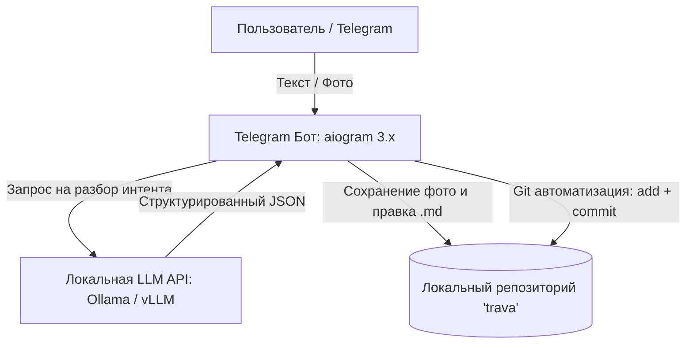
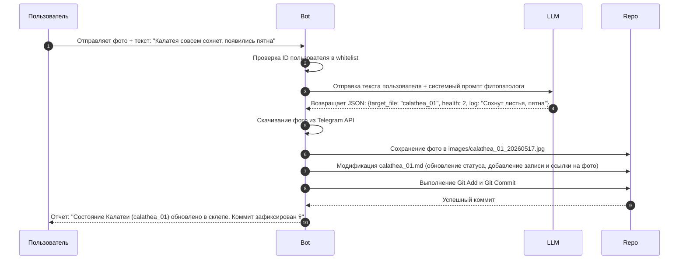

# Техническое задание: Разработка Telegram-агента «GrimSprout»

Проект предназначен для автоматизации ведения персонального репозитория учета растений `trava`. Агент обрабатывает входящие сообщения от владельца через Telegram, анализирует контекст с помощью локальной LLM, обновляет локальные текстовые карточки растений (Markdown) и фотографии, после чего автоматически фиксирует изменения в Git.

---

## 1. Архитектура системы

Агент разворачивается на сервере (например, в Docker-контейнере) и имеет прямой доступ к локальной копии Git-репозитория `trava`, который смонтирован в файловую систему приложения.

2. Стек технологий
Язык программирования: Python 3.10+

Telegram API: aiogram (версия 3.x, асинхронный)

Интеграция с Git: GitPython

Работа с LLM: httpx (для прямых запросов к API) или openai-python / ollama-python крч я хз

Формат конфигурации: PyYAML + config.py файл

Среда развертывания: быдлоскрипт/сервис -> Docker

База данных: Mongodb для всего подряд (пользователи, права, расписания, и т.д.)

3. Функциональные требования
3.1. Безопасность и авторизация
Бот может обрабатывать запросы только от разрешённых пользователей. Добавить пользователя можно руками в базу или "админ" через теоеграм чат соответствующей командой. 

При попытке доступа стороннего пользователя бот должен молчать или отвечать заглушкой «Доступ запрещен», при этом отправив уведоление о новом пользователе админу.

3.2. Взаимодействие с локальной LLM

TBD

3.3. Модуль работы с репозиторием trava
Поиск файлов: Поиск карточки растения осуществляется по совпадению имени в названии файла (например, sansevieria_01.md). Если файл не найден, бот должен предложить создать новый.

Парсинг карточки: Поддержка чтения и редактирования YAML Front Matter (метаданных в начале файла между ---) или парсинг Markdown-таблиц (зависит от структуры репо).

Обработка медиа: * При получении фото бот скачивает его в максимальном качестве.

Фото сохраняется в директорию images/ внутри репозитория.

Имя файла формируется динамически: [id_растения]_[timestamp].jpg.

Ссылка на фото в формате Markdown () добавляется в лог карточки растения.

Git-конвейер: После внесения любых изменений (изменение .md или добавление .jpg) бот автоматически выполняет эквивалент команд:

Bash
git add .
git commit -m "chore(auto): update [plant_name] status via GrimSprout"
4. Сценарии использования (Workflows)
Сценарий: Обновление статуса растения и логирование симптомов

1. Конфигурация и шаблоны данных
Пример файла настроек config.yaml
YAML
telegram:
  allowed_user_ids:
    - 123456789  # Твой Telegram ID

repository:
  path: "/opt/data/trava_repo"
  images_dir: "images"
  templates: "_template"

llm:
  base_url: "http://localhost:11434/v1"
  model: "llama3"
  temperature: 0.1
  system_prompt: >
    Ты — мрачный, но профессиональный ассистент-гробовщик домашних растений. 
    Твоя задача — извлекать данные из сообщений пользователя и возвращать СТРОГИЙ JSON.
Пример шаблона карточки растения: /Users/Yury_Mikhnavets/projects/personal/trava/_template.md 

# История болезни и логи

- **2026-05-17**: Карточка создана автоматически.

1. Этапы реализации
Этап 1 (Базовый каркас): Настройка aiogram, логика авторизации по ID, базовые текстовые команды без LLM (например, /water calathea_01 жестко меняет дату полива в файле). Telegram html элементы управления, выбор контекста (текущее растение, id из "trava")

Этап 2 (Git-модуль): Подключение GitPython, автоматическое создание коммитов при изменении файлов, сохранение картинок из Telegram в локальную папку по маске.

Этап 3 (Интеграция LLM): Подключение локального API. Настройка промптов, парсинг входящего свободного текста в структурированный JSON, сопоставление сущностей с именами файлов.

Этап 4 (Полировка): Обработка ошибок (LLM вернула не JSON, Git упал из-за конфликта लॉक-файла) и добавление фирменной «загробной» стилистики бота в ответах.